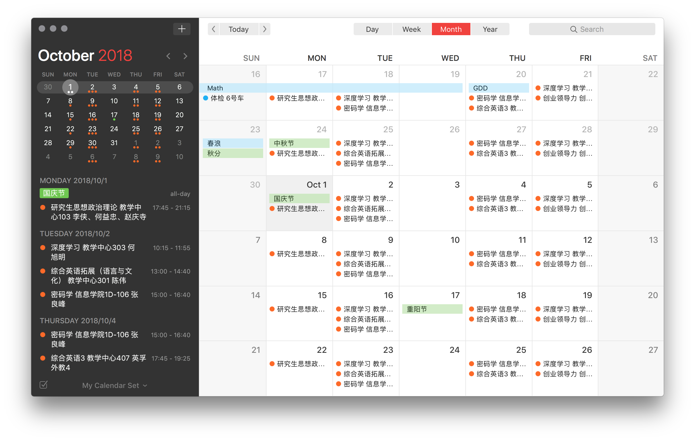

# syllabus2ics

The code is copied from [this article](https://sspai.com/post/39645), I made some changes to fit my own situation(ShanghaiTech).

## Usage

1. Edit `conf_classTime.json` if needed.
2. Edit `classInfo.xlsx` according to the example. Notify `classTime` means the time interval INDEX in `conf_classTime.json`(the index starts from 1).
3. `python excelReader.py` generates class info config.
4. `python main.py` generates .ics file.
5. Open .ics to import to your calendar app.

